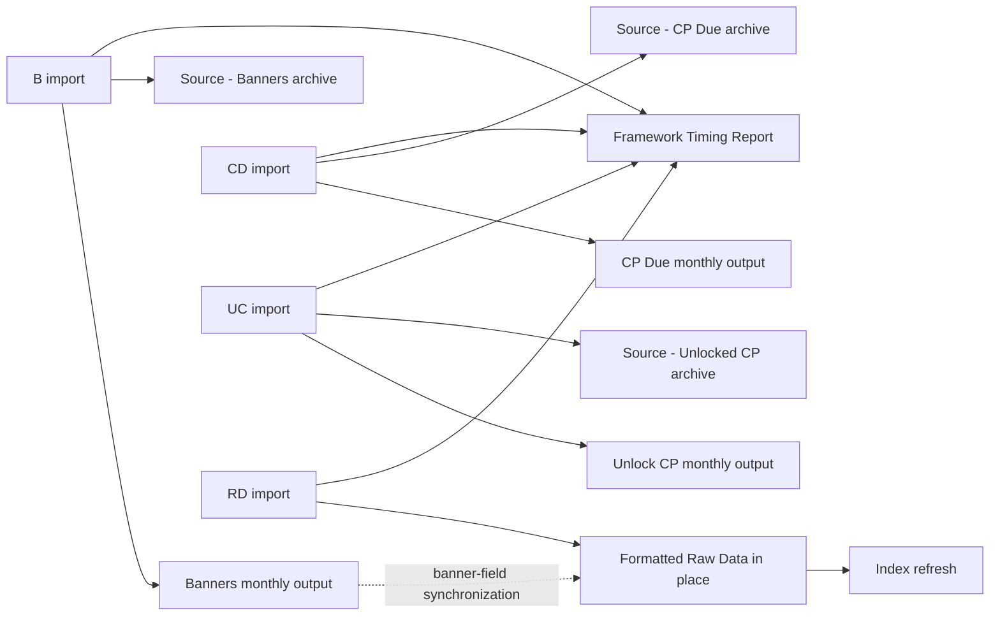
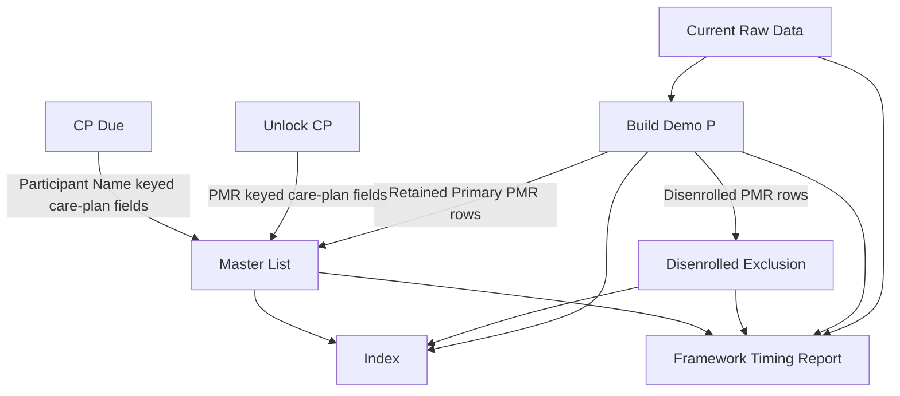
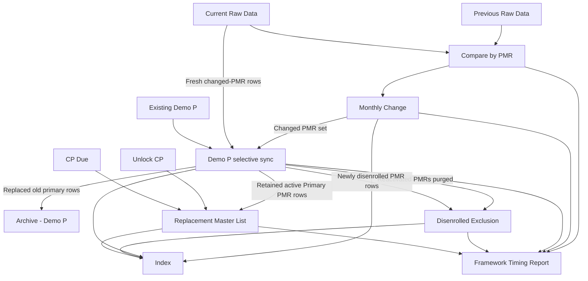

# Master List v1.8.9.3 Monthly Workflow Processing Maps

## Purpose

This report documents the additional workflow context, dependencies, sequencing, sheet lifecycle behavior, and data-flow maps for these menu commands in `Master_List/Current Production Script/v1.8.9.3`:

1. **Format Monthly Sheets** (`formatMonthlySheets`)
2. **Create Monthly Start** (`runMonthlyStart`)
3. **Create Monthly Update** (`runMonthlyUpdate`)

The companion CSV, `v1.8.9.3_Monthly_Workflow_Sheet_Processing.csv`, contains the complete row-by-row table of sheets, data sources, processing, and populated columns.

## Naming conventions

Exact output names are date-dependent. The configured patterns include:

- `Banners mm.yy`
- `CP Due mm.yy`
- `Unlock CP mm.yy`
- `Raw Data <start date> - <end date>`
- `Monthly Change <start date> - <end date>`
- `Master List <start date> - <end date>`

`Demo P` and `Disenrolled Exclusion` are ongoing operational sheets rather than separate date-named monthly outputs.

## Format Monthly Sheets

### Route selection

The workflow prompts once for a locked report month and processes four route codes sequentially:

| Route | Meaning | Source treatment |
|---|---|---|
| `B` | Banners | Creates a template-based output; archives and removes the local import. |
| `CD` | Care Plan Due | Creates a template-based output; archives and removes the local import. |
| `UC` | Unlocked Care Plan | Creates a template-based output; archives and removes the local import. |
| `RD` | Raw Data | Renames and formats the imported sheet in place. |

Missing routes are skipped without stopping the other routes. When several candidates exist, selection preference is: a candidate matching the prompted month, the exact route-code name, and then the first ranked candidate.

### Data-flow map

### Lifecycle distinction

- **B/CD/UC:** input sheet → new output → archive original → delete local input.
- **RD:** input sheet → insert title rows/add governed columns → rename same sheet → retain all imported columns.
- Raw Data's process-created column is `Primary PMR Row`; Banner flags are synchronized from the monthly Banners output when available.

## Create Monthly Start

### Governing sequence

1. Prompt for the month.
2. Confirm replacement before any Demo P mutation when the monthly Master List already exists.
3. Validate current Raw Data.
4. Build `Demo P` from Raw Data.
5. Move disenrolled PMRs from Demo P to `Disenrolled Exclusion`.
6. Build the monthly Master List from retained Primary PMR rows.
7. Enrich Master List from Unlock CP and CP Due.
8. Refresh Index and record timing.

### Data-flow map

### Demo P transformations

Demo P copies matching Raw Data columns and derives the operational presentation fields used downstream. The derived groups include:

- Participant display names.
- Banner Summary.
- Four phone label/value pairs.
- Combined street address.
- Custom field label/value.
- Combined notes.
- Eight flattened contact columns and Contact Summary.
- Demo P creation/update status, month, and source-sheet metadata.

### Disenrollment safeguards

- Disenrolled PMRs are determined from the Demo P disenrollment-date/status fields.
- Re-enrolled PMRs already in Disenrolled Exclusion are purged.
- All rows for a disenrolled PMR are copied to Disenrolled Exclusion.
- Demo P is not rewritten unless the number of rows copied equals the number selected for removal.
- The retained Demo P body is rewritten in one batch.

### Master List ownership

Master List is **not** copied directly from Raw Data. Its governing source is processed Demo P, restricted to rows marked `Primary PMR Row`. It is then enriched as follows:

- Unlock CP is keyed by `PMR #` and supplies `IDT Meeting Date` and `Care Plan Start Date` plus matching identity fields.
- CP Due is keyed by `Participant Name` and supplies `Enrollment Date`, `Last Care Plan`, `Next Care Plan Due`, and `CP Type`.
- If either enrichment report is absent, that synchronization is skipped with a user notification.

## Create Monthly Update

### Fail-closed preflight

Before monthly output mutation, the workflow requires:

- Current-month Raw Data.
- Previous-month Raw Data.
- Existing ongoing Demo P.
- Confirmation to replace the monthly Master List when it already exists.

### Governing sequence

1. Build Monthly Change from previous and current Raw Data.
2. Use the changed PMR set to selectively replace Demo P rows from current Raw Data.
3. Archive replaced primary Demo P rows.
4. Remove reactivated PMRs from Disenrolled Exclusion.
5. Move newly disenrolled PMR rows from Demo P to Disenrolled Exclusion.
6. Rebuild Master List from the cleaned Demo P.
7. Enrich Master List from Unlock CP and CP Due.
8. Refresh Index and record timing.

### Data-flow map

### Monthly Change classification

Changed PMRs are grouped into these report sections:

1. Enrollments
2. Disenrollments
3. Demographic Changes
4. Caseload Changes
5. Contact Changes
6. Banner Summary Changes
7. Other Changes

The report contains current-month rows and highlights changed columns. If no qualifying changes exist, no Monthly Change report is created.

### Selective Demo P replacement

Only PMRs included by Monthly Change are rebuilt from current Raw Data. The workflow:

- Builds fresh, flattened rows for changed PMRs.
- Validates that every changed PMR has replacement coverage.
- Retains all unchanged Demo P rows.
- Archives the old primary rows before mutation.
- Combines retained and fresh rows and batch-writes the body.
- Leaves Demo P intact when Monthly Change contains no changed PMRs.

### Staged Master List replacement

When a monthly Master List already exists and replacement was approved during preflight, the script creates a hidden staged sheet, populates and validates it, and then promotes it to the final governed name. This avoids deleting the existing final output before the replacement is successfully built.

## Shared processing conclusions

1. Format Monthly Sheets is the import-normalization stage.
2. Raw Data is the source for Demo P, but Master List is sourced from processed Demo P rather than Raw Data directly.
3. Disenrolled Exclusion is sourced from Demo P, not directly from Raw Data.
4. Create Monthly Start initializes Demo P without producing Monthly Change.
5. Create Monthly Update requires both previous and current Raw Data and uses Monthly Change to limit Demo P replacement to changed PMRs.
6. Archive - Demo P is written only when existing Demo P rows are replaced during monthly synchronization.
7. Unlock CP and CP Due are enrichment sources for Master List; neither workflow writes back to those reports.
8. Index contains workbook/sheet metadata, and Framework Timing Report contains execution telemetry; neither is a participant-data output.

## Source traceability

The findings are based on these implementation areas in `v1.8.9.3`:

- Menu callbacks and route orchestration: `formatMonthlySheets`, `runMonthlyStart`, `runMonthlyUpdate`.
- Monthly source selection and formatter functions.
- Default governed header sets for all business sheets.
- Raw Data in-place formatter and Primary PMR assignment.
- Demo P build and selective monthly sync.
- Disenrollment move/append/rewrite functions.
- Monthly Change comparison and section population.
- Master List primary-row copy and care-plan synchronization.
